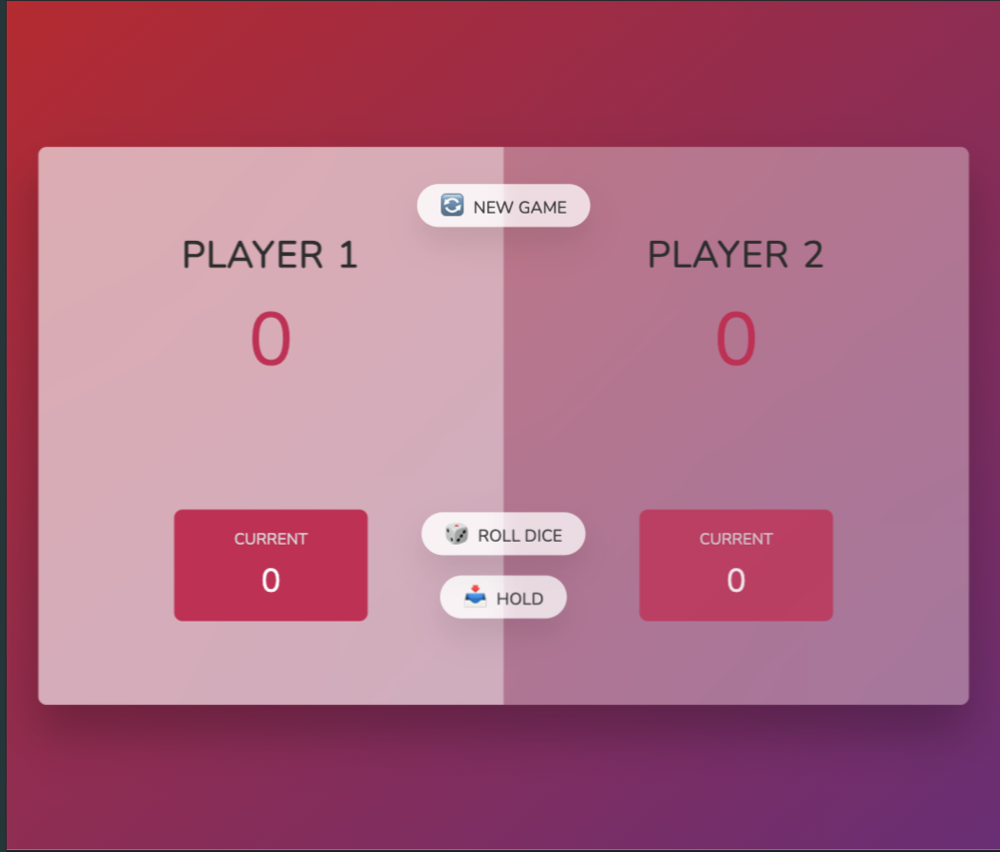
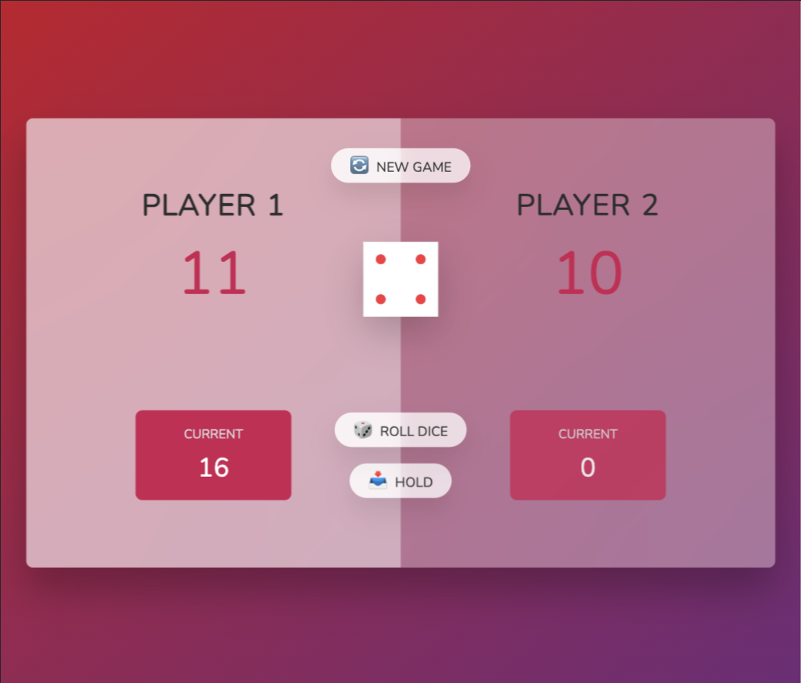

# Pig Dice Game

Welcome to the Pig Dice Game! This project is a simple implementation of the Pig Dice Game using HTML, CSS, and JavaScript.

## Table of Contents

- [Game Rules](#game-rules)
- [Features](#features)
- [Installation](#installation)
- [Usage](#usage)
- [Screenshots](#screenshots)
- [Contributing](#contributing)

## Game Rules

The Pig Dice Game is a simple dice game where players take turns to roll a single die as many times as they wish, adding the value of each roll to a running total, but losing their gained score for the turn if they roll a 1.

- Each turn, a player repeatedly rolls a die until either a 1 is rolled or the player decides to "hold":
  - If the player rolls a 1, they score nothing and it becomes the next player's turn.
  - If the player rolls any other number, it is added to their turn total and the player's turn continues.
  - If a player chooses to "hold", their turn total is added to their score, and it becomes the next player's turn.
- The first player to reach or exceed 100 points wins the game.

## Features

- Two-player gameplay
- Roll dice functionality
- Hold functionality to save the current score
- Winner announcement
- Simple and user-friendly interface

## Installation

1. Clone the repository:
    ```bash
    git clone https://github.com/yourusername/pig-dice-game.git
    ```
2. Navigate to the project directory:
    ```bash
    cd pig-dice-game
    ```

## Usage

1. Open the `index.html` file in your web browser.
2. Enjoy the game!

## Screenshots


*Game Start Screen*


*Player Rolling Dice*


*Winner Announcement*

## Contributing

Contributions are welcome! Please feel free to submit a Pull Request.
